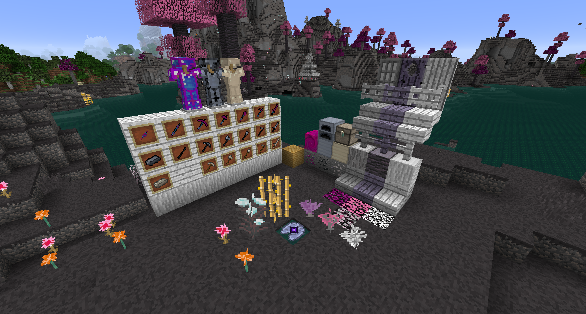
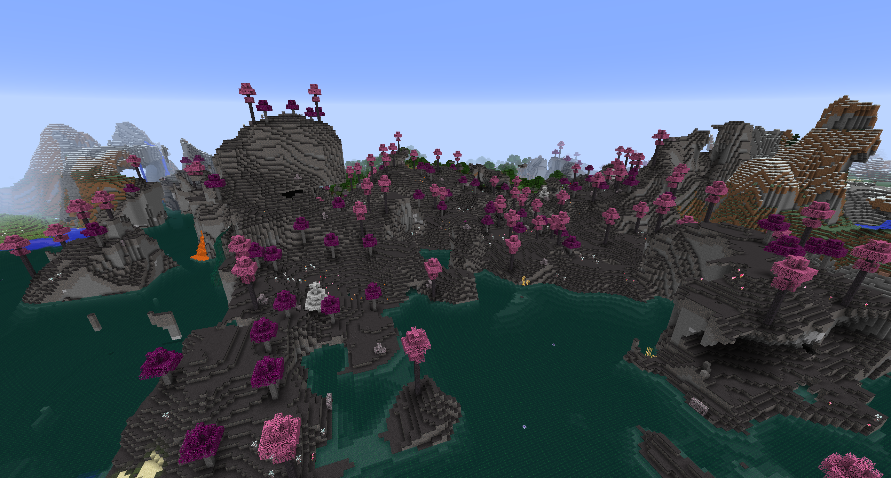
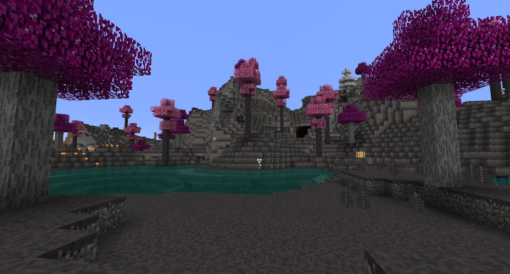

# Sublime

A biome mod for Minecraft 1.12.2. Primarily built for personal enjoyment.

Available for download on [CurseForge](https://www.curseforge.com/minecraft/mc-mods/sublime).

## Features

* *Sublime Biome*
* *Muted Dirt*, *Muted Grass*
* *Bloodless Elm Tree*, *Hanami Tree*, *Yedoensis Tree*
  * Sapling
  * Leaves
  * Log
  * Planks
  * Stairs
  * Slab
  * Fence
  * Fence Gate
  * Door
* *Fallen Leaves*
* *Thatch*
* *Iridium*, *Tungsten*, *Niobium*
  * Ore
  * Block
  * Tools
  * Armor
* *Iridium Rod*, *Tungsten Rod*
* *Tungsten Furnace*
* *Niobium Chest*
* *Calamagrostis*
* *Astrantia*
* *Chrysanthemum*
* *Eterisk*
* *Lotus*

## Images

